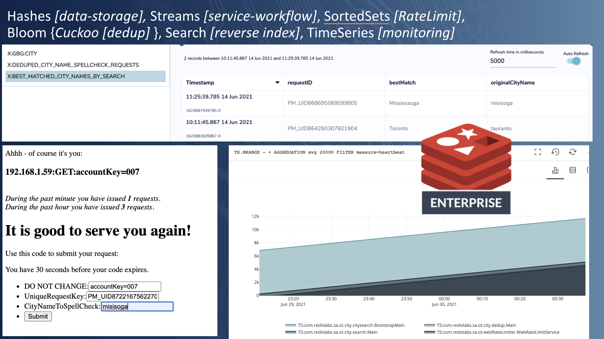
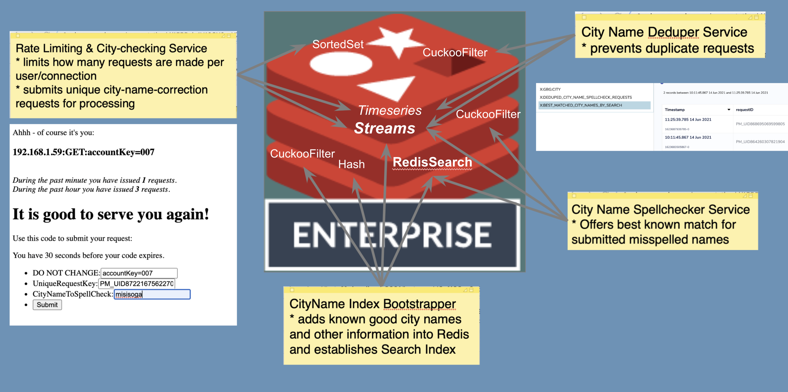
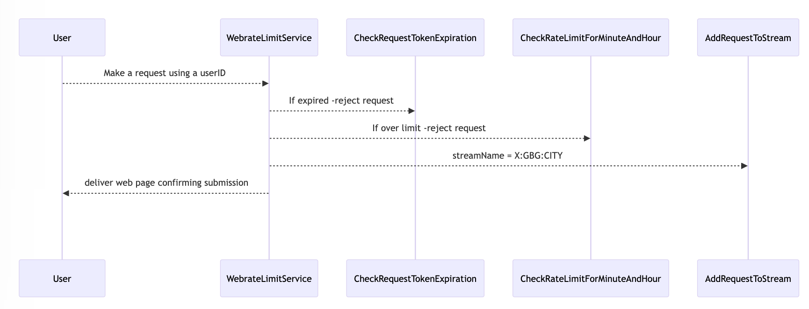
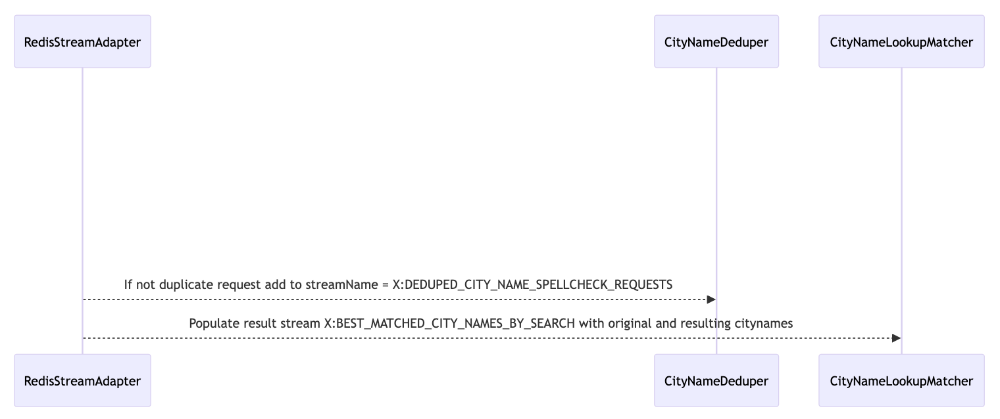
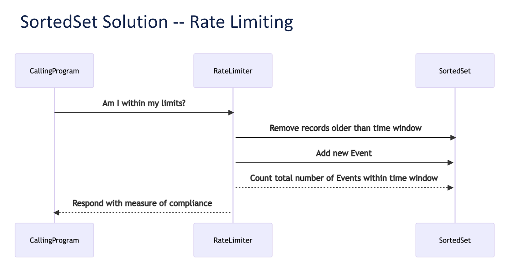

* You will need an instance of Redis running Search, Bloom, and TimeSeries modules to run this example.
* You can sign up for a free cloud instance here: https://redis.com/try-free/

# Question: 
What is this?

# Answer 1:
A Redis-powered, Web-based, Spell-Checking Application
# Answer 2: 
A Multi-modal Redis-based Application Showcasing:
* Streams used to trigger execution of multiple microservices and remember their inputs
* SortedSets used for Rate Limiting
* TimeSeries used to monitor the heartbeats of 4 services
* Hashes used to store reference data and results data
* Strings used to act as expiring request tokens
* Cuckoo Filters used to dedup incoming requests
* Search indexes used to allow phonetic and fuzzy matching lookups
* TopK used to remember the top 10 most frequently submitted misspelled entries

### WebRateLimiter and Redis Search application

This example embeds a Java webserver ( https://sparkjava.com/documentation )

#### This web-app is the front end of a micro-services demo involving a deduper and a search lookup. Not mentioned in the following diagram is the use of <em>Strings</em> as expiring request tokens as well as <em>TopK</em> for reporting all incoming submissions for city name cleanup (including those that are not processed)






The main flow of the application is driven by the user who submits possible city names for verification / correction:


Behind the scenes: by two separate microservices (in an asynchronous fashion) -the requests are deduped and then processed through a redis search effort:



The premise of the overall demo is - spell check / cleanse submitted city names. The best match is added to the X:BEST_MATCHED_CITY_NAMES_BY_SEARCH stream for processing by an imaginary (out-of-scope) service that might use the information to search and replace entries in a large-scale data cleansing routine.

Reference [good] City address data is loaded from a csv file populated with data from a free data set provided by: https://simplemaps.com/


The various services are connected asynchronously through redis streams.

They all emit a heartbeat to redis TimeSeries every 10 seconds to show they are healthy.
Try this query:

```
TS.MRANGE - + AGGREGATION count 30000 FILTER sharedlabel=heartbeat GROUPBY customlabel reduce avg 
```

One service loads the redis database with Hashes containing Canadian city names and a nod to NY.
It also creates the search index so that others can search for citynames.

Another service deduplicates the entries made by users so the spellchecking/lookup/search effort is assigned (added to the stream) only one time for each unique entry.

The last service does the search lookup using phonetic and fuzzy matching to grab the closest match and writes the best match to a stream.

### The sliding window rate limiter pattern used in this app is borrowed from this python example available here:
https://github.com/maguec/RateLimitingExample/tree/sliding_window

This is a Java code example of limiting number of requests to a webserver using Redis SortedSets API

Each accountKey coming from a particular IP address is allowed X requests/minute and Y requests/hour

These limits are defined in WebRateLimitService.java:

    int ratePerMinuteAllowed = 5;
    int ratePerHourAllowed = 25;

Hit the webserver a few times with requests with the same accountKey to see the response change from a friendly welcome to a friendly -- too many requests.

Due to the use of zremrangeByScore and the score being equal to the time the request occurred, the application does a good job
of providing a sliding window of allowed requests.




To run the example:
* plan to run the project in an environment supporting Maven (getting the jars manually is a pain)
* provide the -h < host > and -p < port > and optional -s < password > as you kick it off
  (make sure your redis instance supports the TimeSeries, Search, and Blooom modules)

```
mvn compile exec:java -Dexec.cleanupDaemonThreads=false -h <redishost> -p <redisport> -s <redispass> 
```

If you want to have each of the 4 services started with a lengthy pause between them you can pass the 'goslow' argument to the Main.main method like this:

``` 
mvn compile exec:java -Dexec.cleanupDaemonThreads=false -Dexec.args="-h <redishost> -p <redisport> -s <redispass> goslow"
```
(you will have to wait 2 + minutes for the full launch in this case)

---

### Additional Keys/commands to look into using RedisInsights:
```
city*
X:GBG*
X:DED*
X:BEST*
z:rate*
PM_UID*
gbg*
java.lang.Runtime*
TOPK.LIST TOPK:WRL:TOP_TEN_SUBMITTED_CITY_NAMES
history*
```
---
## Usage information for the curious:
From a browser use http://[host]:4567?accountKey=[yourKey]

Example ...  https://127.0.0.1:4567?accountKey=007

Fill in the form and submit a mis-spelled city name - example: <em>brewklin</em>

Note that the services that offer up a best guess for an improved result are asynchronous and their results are stored in the X:BEST_MATCHED_CITY_NAMES_BY_SEARCH stream as well as the various history* hashes you can find (it would be a simple and useful exercise to add a search index for these hashes - I leave this to the reader to accomplish)
The response will show how many requests have been made in the last minute and last hour.

Each request made through the web-UI results in an entry being added to a redis stream that will be processed by various services. 

---

To see what is happening in Redis you can use RedisInsight   https://redislabs.com/redis-enterprise/redis-insight/
(look at the streams section to see entries being added to the streams)
(look at the SortedSets to see what rate-limiting data is being processed there)
or redis-cli:

127.0.0.1:6379> keys z:*
1) "z:rateLimiting:127.0.0.1:GET:accountKey=008:minute"
2) "z:rateLimiting:127.0.0.1:GET:accountKey=008:hour"

127.0.0.1:6379> zrange z:rateLimiting:127.0.0.1:GET:accountKey=008:minute 0 -1 withscores
 1) "z:rateLimiting:127.0.0.1:GET:accountKey=008:minute:17-17-41:759"
 2) "1611011861759"
 3) "z:rateLimiting:127.0.0.1:GET:accountKey=008:minute:17-17-42:555"
 4) "1611011862555"
 5) "z:rateLimiting:127.0.0.1:GET:accountKey=008:minute:17-17-43:471"
 6) "1611011863471"
 7) "z:rateLimiting:127.0.0.1:GET:accountKey=008:minute:17-17-44:012"
 8) "1611011864012"
 9) "z:rateLimiting:127.0.0.1:GET:accountKey=008:minute:17-17-45:347"
10) "1611011865347"

127.0.0.1:6379> zrange z:rateLimiting:127.0.0.1:GET:accountKey=008:hour 0 -1 withscores
 1) "z:rateLimiting:127.0.0.1:GET:accountKey=008:hour:17-15-59:959"
 2) "1611011759959"
 3) "z:rateLimiting:127.0.0.1:GET:accountKey=008:hour:17-16-05:143"
 4) "1611011765143"
 5) "z:rateLimiting:127.0.0.1:GET:accountKey=008:hour:17-16-06:754"
 6) "1611011766754"
 7) "z:rateLimiting:127.0.0.1:GET:accountKey=008:hour:17-16-07:412"
 8) "1611011767412"
 9) "z:rateLimiting:127.0.0.1:GET:accountKey=008:hour:17-16-09:370"
10) "1611011769370"
11) "z:rateLimiting:127.0.0.1:GET:accountKey=008:hour:17-17-41:759"
12) "1611011861759"
13) "z:rateLimiting:127.0.0.1:GET:accountKey=008:hour:17-17-42:555"
14) "1611011862555"
15) "z:rateLimiting:127.0.0.1:GET:accountKey=008:hour:17-17-43:471"
16) "1611011863471"
17) "z:rateLimiting:127.0.0.1:GET:accountKey=008:hour:17-17-44:012"
18) "1611011864012"
19) "z:rateLimiting:127.0.0.1:GET:accountKey=008:hour:17-17-45:347"
20) "1611011865347"

---
<h4>
* A small shell script is included in this project that calls the webserver using httpie


NB: You must have httpie installed to use this effectvely

https://httpie.io/docs/cli/installation

https://httpie.io/docs/cli


An example invocation is:
```
/littlewrlloader.sh 300 25
```
</h4>
